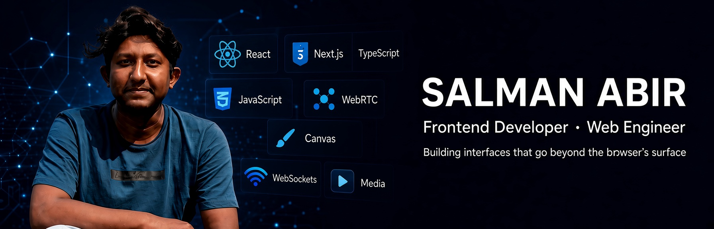
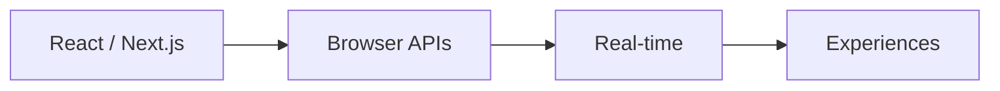

<!--
  SALMAN ABIR — GitHub Profile
-->

<div align="center">
  
</div>

<p align="center">
  
</p>

<p align="center">
  
</p>

<div align="center">

  <a href="https://github.com/SalmanAAbir">
    
  </a>
  <a href="https://www.linkedin.com/in/salman-abir/">
    
  </a>
  <a href="mailto:salmanabir28@gmail.com">
    
  </a>

  <br /><br />

  
</div>

---

## About

Frontend developer since **2017**. I ship production interfaces in **React, Next.js, and TypeScript** — then go one layer deeper into the browser: media, canvas, and real-time communication.

I don’t just consume web APIs. I want to know how they behave under load, what they cost, and when they’re the right tool.



---

## What I ship

<table>
<tr>
<td width="50%" valign="top">

**Modern web apps**  
Type-safe React/Next.js systems, component architecture, and UIs that stay fast as they grow.

`React` `Next.js` `TypeScript` `Performance`

</td>
<td width="50%" valign="top">

**Media & streaming**  
Custom players, HLS, recording, and playback experiences that feel native in the browser.

`Video.js` `HLS` `Media APIs` `RecordRTC`

</td>
</tr>
<tr>
<td width="50%" valign="top">

**Real-time**  
Peer connections, live collaboration, screen share — WebRTC and WebSockets used with intent.

`WebRTC` `WebSockets` `Data Channels`

</td>
<td width="50%" valign="top">

**Interactive surfaces**  
Canvas graphics, editors, and dense data UIs where the platform does more than paint components.

`Canvas` `Konva` `TinyMCE` `TUI Grid`

</td>
</tr>
</table>

---

## Stack

<p>
  
  
  
  
  
  
  
  
  
  
  
  
</p>

**Browser** · WebRTC · WebSockets · Canvas · MediaRecorder / Web Audio · HLS · Web Workers  

**Libraries** · `Video.js` · `Konva` · `Swiper` · `TUI Grid` · `TinyMCE` · `RecordRTC` · `noUiSlider`

---

## Selected work

| | Focus | What I actually build |
| --- | --- | --- |
| 🎬 | **Media & video** | Playback UIs, HLS, YouTube embeds, recording pipelines |
| 💎 | **E-commerce** | Interactive storefronts with attention to load and UX |
| 🧪 | **Platform experiments** | WebRTC, sockets, canvas, and media APIs — to find the edge of what’s possible |

> Production work lives in private repos. Public experiments are below — that’s intentional.

---

## Now

```text
exploring   Canvas · Media APIs · Web Workers
building    Real-time + streaming interfaces
next        Tighter media pipelines, better peer UX
```

<details>
<summary><b>What I’d like to build next</b></summary>

- Real-time video platform — WebRTC · WebSockets · React  
- Collaborative whiteboard — Canvas · WebSockets  
- Browser recording studio — MediaRecorder · Web Audio  
- Screen-sharing product — WebRTC · Media APIs  
- Live streaming UI — HLS · Video.js  

</details>

---

## GitHub

<div align="center">
  
  
</div>

<div align="center">
  
</div>

---

## Connect

<div align="center">

Have something interesting — media, real-time, or a hard UI problem?

**Let’s build it.**

<a href="https://www.linkedin.com/in/salman-abir/">
  
</a>
<a href="mailto:salmanabir28@gmail.com">
  
</a>
<a href="https://github.com/SalmanAAbir">
  
</a>

<br />

`Build → Break → Learn → Improve → Repeat`

</div>
